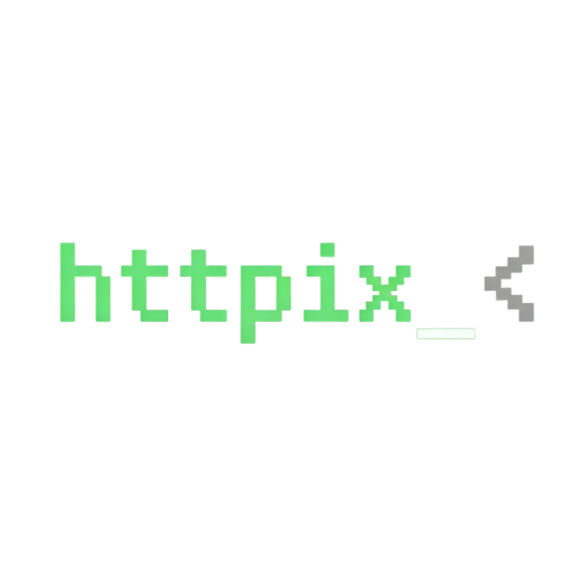

<p align="center">
  
</p>
<h1 align="center">httpix_<</h1>
<p align="center">
  <strong>Terminal-based HTTP client — fast, minimal, and fully keyboard-driven.</strong>
</p>
<p align="center">
  <a href="#">🌐 Homepage</a> &nbsp;·&nbsp;
  <a href="#">📖 Docs</a> &nbsp;·&nbsp;
  <a href="#">🐛 Issues</a>
</p>
<p align="center">
  
  
  
  
</p>

---

## ✨ Features

- ⚡ **Interactive TUI** — Built with Bubble Tea for a smooth, responsive terminal experience
- 🌐 **Full HTTP Support** — GET, POST, PUT, PATCH, DELETE, HEAD, OPTIONS out of the box
- 🎯 **Keyboard-Driven** — Every action is reachable without touching a mouse
- 🔄 **Async Requests** — Non-blocking HTTP calls keep the UI responsive at all times
- 🧭 **Method Switching** — Cycle through HTTP methods instantly with a single shortcut
- 🧩 **Composable UI** — Modular components built with Bubbles & Lipgloss
- 🎨 **Beautiful Theme** — Catppuccin Mocha colour palette baked in
- 🖥️ **Platform-Aware** — Keybindings auto-adapt between macOS and Linux/Windows
- 📜 **Request History** — Browse, select, and replay the last 50 requests from the sidebar
- ✏️ **JSON Formatter** — Pretty-print your request body with a single shortcut

---

## 🏗️ Tech Stack

| Technology | Role |
|---|---|
| [Go 1.22](https://go.dev) | Language |
| [Bubble Tea](https://github.com/charmbracelet/bubbletea) | Elm-architecture TUI framework |
| [Bubbles](https://github.com/charmbracelet/bubbles) | textinput, textarea, viewport, spinner widgets |
| [Lipgloss](https://github.com/charmbracelet/lipgloss) | Styling, layout, borders |
| [Glamour](https://github.com/charmbracelet/glamour) | Markdown / JSON syntax highlighting |
| [Harmonica](https://github.com/charmbracelet/harmonica) | Smooth animation utilities |

---

## 🚀 Getting Started

### Prerequisites

- **Go** ≥ 1.22

### Installation

```bash
git clone https://github.com/yourusername/httpix.git
cd httpix
go mod tidy
```

### Run

```bash
go run ./cmd/httpix
```

### Build Binary

```bash
go build -o httpix ./cmd/httpix
./httpix
```

---

## ⌨️ Keyboard Shortcuts

### macOS

| Key | Action |
|---|---|
| `⌃S` / `F5` | Send request |
| `⇥` / `⇧⇥` | Cycle panel focus |
| `⌥←` / `⌥→` | Change HTTP method |
| `⌥[` / `⌥]` | Switch tab (Body / Headers / Params) |
| `⌃F` | Format JSON body |
| `⌃K` | Clear history |
| `↑` / `↓` | Navigate history (when History panel focused) |
| `⌃C` | Quit |

### Linux / Windows

| Key | Action |
|---|---|
| `ctrl+↵` / `F5` | Send request |
| `Tab` / `⇧Tab` | Cycle panel focus |
| `ctrl+←` / `ctrl+→` | Change HTTP method |
| `ctrl+[` / `ctrl+]` | Switch tab (Body / Headers / Params) |
| `ctrl+f` | Format JSON body |
| `ctrl+d` | Clear history |
| `↑` / `↓` | Navigate history (when History panel focused) |
| `ctrl+c` | Quit |

---

## 📁 Project Structure

```
httpix/
├── cmd/httpix/
│   └── main.go              # Entry point — only tea.NewProgram + Run()
│
├── config/
│   ├── types.go             # Shared domain types: Panel, BodyTab, HTTPMethods
│   ├── theme.go             # Catppuccin Mocha palette + all lipgloss styles
│   └── keymap.go            # KeyMap struct + per-platform bindings
│
├── httpclient/
│   └── client.go            # Pure HTTP layer, zero bubbletea knowledge
│
└── tui/
    ├── model.go             # Model struct + message types
    ├── init.go              # New() constructor + Init()
    ├── update.go            # Update() + all message/key handlers
    ├── view.go              # View() — composes components into a string
    ├── props.go             # Mapper: Model → Props for each component
    ├── util.go              # Pure helpers (JSON formatter)
    │
    └── component/           # Pure render functions — Props in, string out
        ├── topbar.go        # Title bar + platform badge + loading indicator
        ├── urlrow.go        # Method badge + URL input + SEND button
        ├── requestpanel.go  # Tabbed editor (Body / Headers / Params)
        ├── responsepanel.go # Status badge + meta + scrollable body
        ├── sidebar.go       # Request history
        └── statusbar.go     # Keyboard hint bar
```

---

## 🔗 How the Layers Work

BLINK uses a **Layered Architecture** — flat, predictable, and import-cycle-free.

```
┌──────────────────────────────────────────┐
│           cmd/httpix/main.go              │
└─────────────────┬────────────────────────┘
                  │
┌─────────────────▼────────────────────────┐
│              tui/                         │
│   model ─── update ─── view              │
│                │            │             │
│             props ──► component/          │
└─────────────────────────────┬────────────┘
                              │
         ┌────────────────────┼──────────────┐
         │                   │               │
┌────────▼───────┐  ┌────────▼───────┐  ┌───▼──────┐
│  httpclient/   │  │   config/      │  │  stdlib  │
│  Execute()     │  │  types/theme/  │  │          │
│  pure HTTP     │  │  keymap        │  │          │
└────────────────┘  └────────────────┘  └──────────┘
```

| Package         | May import |
|-----------------|---|
| `config`        | stdlib only |
| `httpclient`    | stdlib only |
| `tui/component` | `config`, `httpclient`, stdlib |
| `tui`           | `config`, `httpclient`, `tui/component`, stdlib |
| `cmd/httpix`    | `tui` only |

---

## 📜 License

This project is open-source. See [LICENSE](LICENSE) for details.

---

<p align="center">
  Made with ❤️ by <a href="https://github.com/alfarezyyd">alfarezyyd</a>
</p>